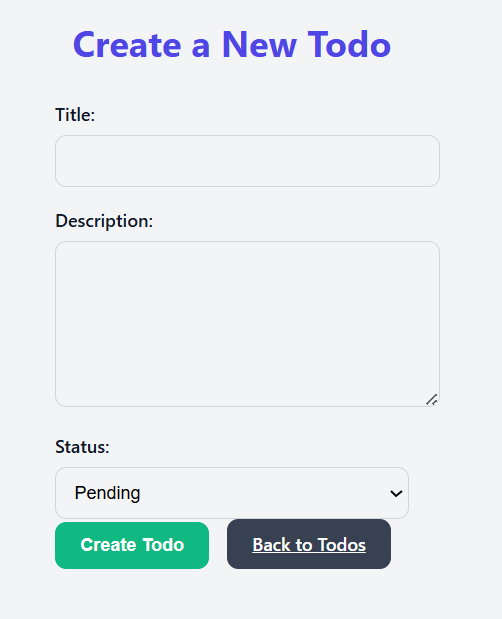
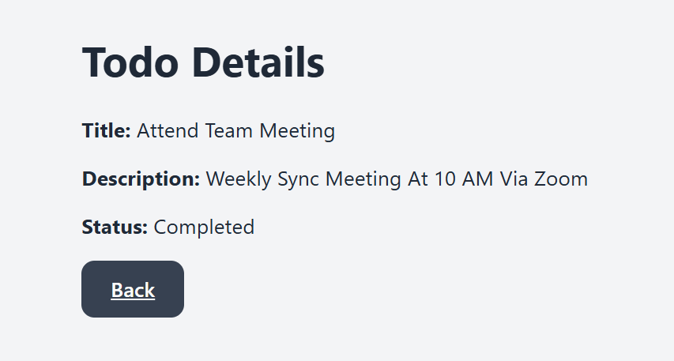
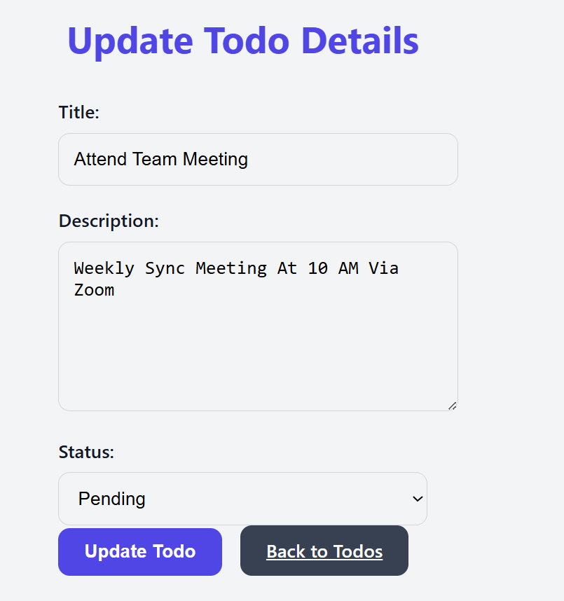

# React Todo App with Local Caching and Offline Support

A simple and responsive Todo List application built with **React**, supporting **CRUD** operations, **search & filter**, **pagination**, **localStorage caching (localforage)**, and **offline access using IndexedDB (Dexie.js)**.

---

## Features

- Create, Read, Update, and Delete (CRUD) todos
- Search todos by title and filter by status
- Paginate todo list for better UX
- API response caching using `localforage` via `localStorage`
- Offline capability via `Dexie.js` and IndexedDB
- WCAG AA-compliant styling for accessibility
- Fully responsive and mobile-friendly
- Simple routing using `react-router-dom`

---

## Installation & Setup

### Prerequisites

- Node.js & npm installed
- JSON Server (for mock backend)

### 1. Clone the repository

```bash
git clone https://github.com/your-username/todo-app.git
cd todo-app
```

### 2. Install dependencies

```bash
npm install
```

### 3. Start the mock API server

Ensure you have a `db.json` file in the root with todo data.

```bash
npx json-server --watch db.json --port 3006
```

### 4. Run the React app

```bash
npm start
```

The app will be available at [http://localhost:3000](http://localhost:3000)

---

## Available Scripts

| Command           | Description                     |
| ----------------- | ------------------------------- |
| `npm start`       | Starts the development server   |
| `npm run build`   | Builds the app for production   |
| `npx json-server` | Starts the mock REST API server |

---

## Technology Stack

- **React** – Frontend framework
- **React Router DOM** – Page routing
- **localforage** – Caching API responses in localStorage
- **Dexie.js** – IndexedDB wrapper for offline storage
- **JSON Server** – Mock RESTful API
- **CSS (App.css)** – Centralized and accessible styling

### 🔧 Architecture Decisions

- Used `localforage` to abstract localStorage and handle async cache storage.
- Adopted `Dexie.js` for easy and powerful offline data handling via IndexedDB.
- Centralized UI styling in `App.css` for maintainability.
- Adopted paginated listing and filtering to manage large data efficiently.

---

## 🛠 API Documentation

### Base URL

```
http://localhost:3006/todos
```

### Endpoints

| Method | Endpoint     | Description         |
| ------ | ------------ | ------------------- |
| GET    | `/todos`     | Fetch all todos     |
| GET    | `/todos/:id` | Fetch a single todo |
| POST   | `/todos`     | Create a new todo   |
| PUT    | `/todos/:id` | Update a todo       |
| DELETE | `/todos/:id` | Delete a todo       |

#### Sample Payload

```json
{
  "title": "Learn React",
  "description": "Complete React basics tutorial",
  "status": "Pending"
}
```

---

## Screenshots

### Main Todo List with Search, Filter, and Pagination


### Create Todo Form



### View Details Page



### Update Todo Page



---

## Known Issues

- No routing to the newly created To-do page immediately after its been created.

---

## 🔮 Future Improvements

- Add user authentication
- Add dashboard analytics for completed tasks
- Push/browser notifications for reminders

---

## 👩🏽‍💻 Author

**Mariam Lawal** – [GitHub](https://github.com/tvy0r) | Alt School ID: `ALT/SOE/024/0468`

---
